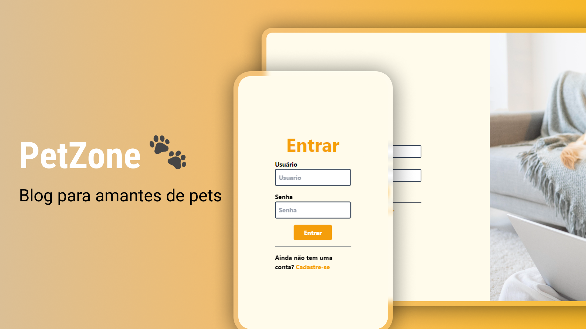

#  🐾 PetZone

Bem-vinde ao PetZone – um blog criado para amantes de pets que desejam compartilhar experiências, dicas, e histórias sobre seus amigos de quatro patas. Este projeto tem como objetivo criar uma comunidade onde as pessoas possam aprender mais sobre o cuidado com seus animais, trocar ideias, e se conectar com outros amantes de pets.

 

### 🎯 Objetivo do Projeto
É um blog desenvolvido em React que oferece um espaço para:

- Compartilhar dicas sobre cuidados, alimentação, e adestramento de pets.

- Divulgar histórias e experiências dos usuários com seus pets.

- Permitir que os usuários criem seus perfis para acompanhar as postagens de outros membros e compartilhar suas próprias experiências.

### 🚀 Tecnologias Utilizadas
- React: Biblioteca JavaScript para a construção da interface do usuário.
- Tailwind CSS: Framework CSS para estilização rápida e responsiva.
- React Router: Gerenciamento de rotas dentro da aplicação.
- Axios: Biblioteca para fazer requisições HTTP.
- Google Fonts: Para a integração das tipografias amigáveis.